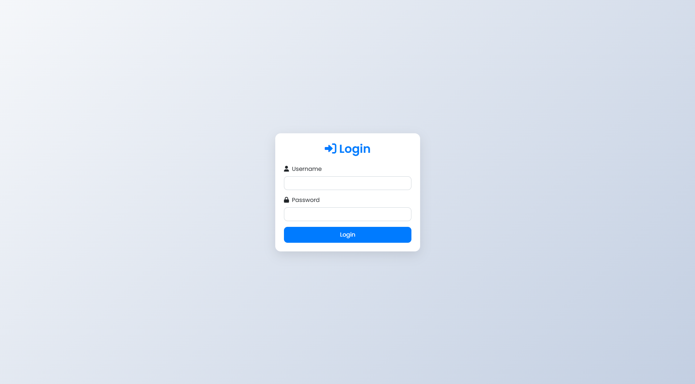
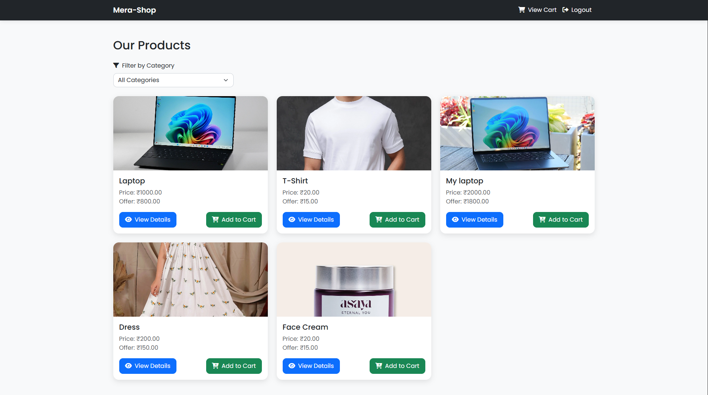
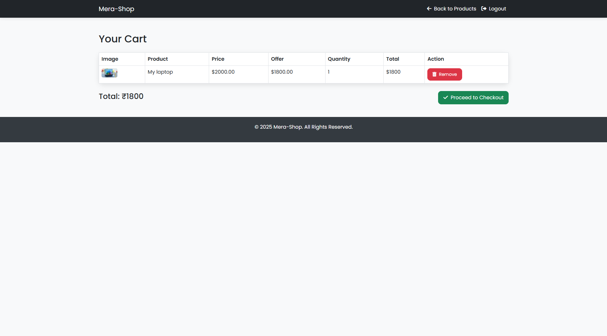
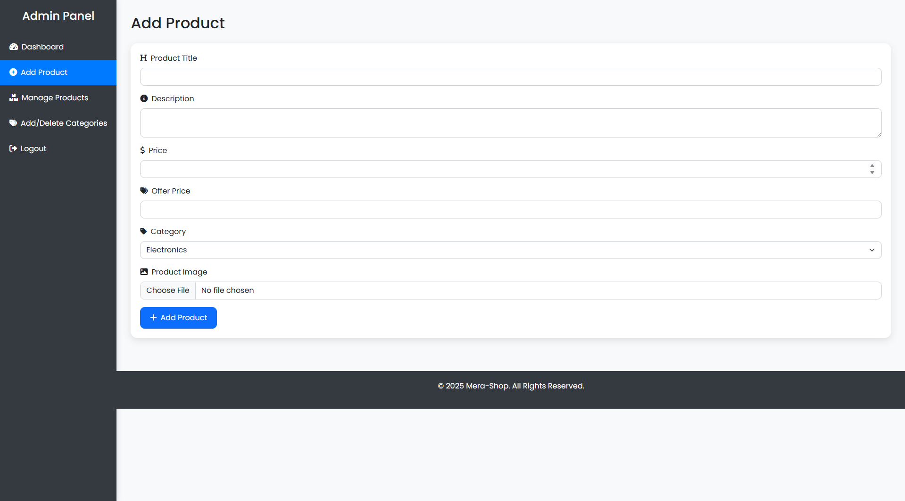
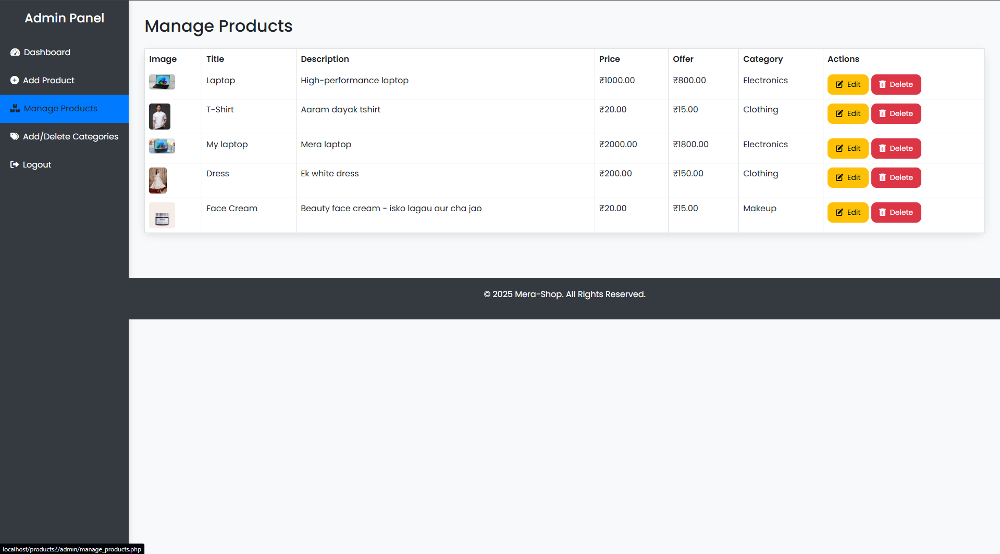
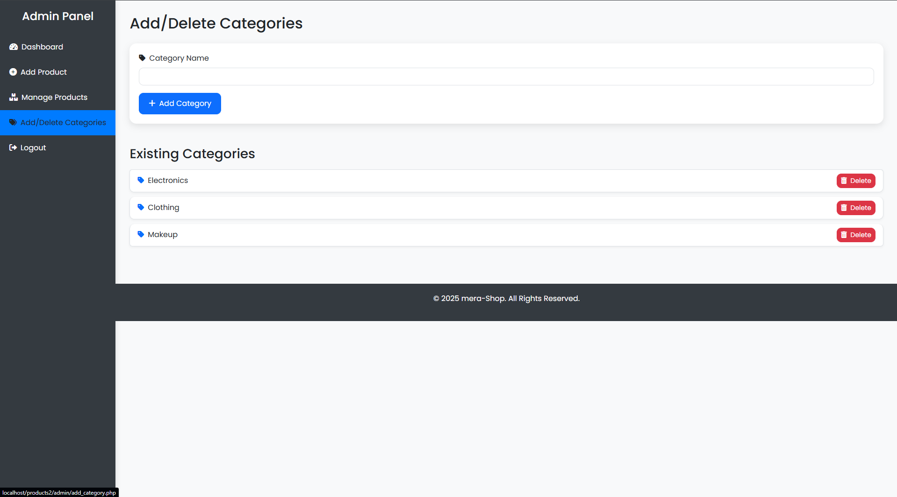

# 🛒 Ecommerce Web Application

A fully functional **Ecommerce Website** built using **PHP** and **MySQL**, featuring a clean separation between **user** and **admin** operations. It includes dynamic product listings, detailed product views, shopping cart management, and a robust admin interface for product and category management.

---

## ✨ Features

### 👤 User Side

* User Login / Logout
* Browse products by category
* View detailed product pages
* Add products to cart
* View and manage cart contents

### 🛠️ Admin Side

* Admin Login / Logout
* Add new products with images
* Edit or delete existing products
* Create and manage product categories

---

## 🧰 Prerequisites

* PHP 7.4 or higher
* MySQL
* A local web server (e.g., [XAMPP](https://www.apachefriends.org/) or [WAMP](http://www.wampserver.com/))
* Git (optional, for cloning the repo)

---

## ⚙️ Setup Instructions

### 1️⃣ Clone the Repository

```bash
git clone https://github.com/MR-1124/PHP---Ecommerce-Learning-Project/
cd PHP---Ecommerce-Learning-Project
```

### 2️⃣ Configure the Database

1. Create a new MySQL database named `ecommerce`.
2. Import the provided SQL dump in XAMPP:

This will create the required tables and insert initial sample data.

### 3️⃣ Set Up Configuration

1. Rename `config.sample.php` to `config.php`.
2. Open `config.php` and update the following values:

```php
$servername = "localhost";
$username = "your_mysql_username";
$password = "your_mysql_password";
$database = "ecommerce";
```

### 4️⃣ Set Up the Web Server

* Place the entire `PHP---Ecommerce-Learning-Project/` folder in your server's root directory:

  * For XAMPP: `htdocs/`
* Ensure the `uploads/` folder has **write permissions** (for product image uploads).

---

## 🌐 Accessing the Application

1. Start your Apache and MySQL server.
2. Open your browser and visit:

```
http://localhost/PHP---Ecommerce-Learning-Project/
```

### 🔐 Demo Credentials

#### 👥 User

* **Username:** `user`
* **Password:** `user123`

#### 🛠️ Admin

* **Username:** `admin`
* **Password:** `admin123`

---

## 📷 Screenshots

### 🏠 Homepage



### 🛍️ Products Page



### 🛒 Cart Page



### 🔧 Admin Dashboard







---

## 👤 Author

**Mayan Roy**

---

## 🗓️ Project Completion Date

**June 09, 2025**


